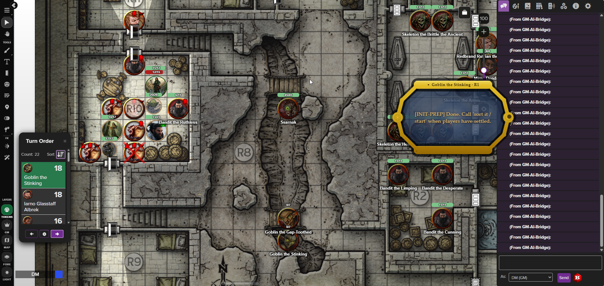
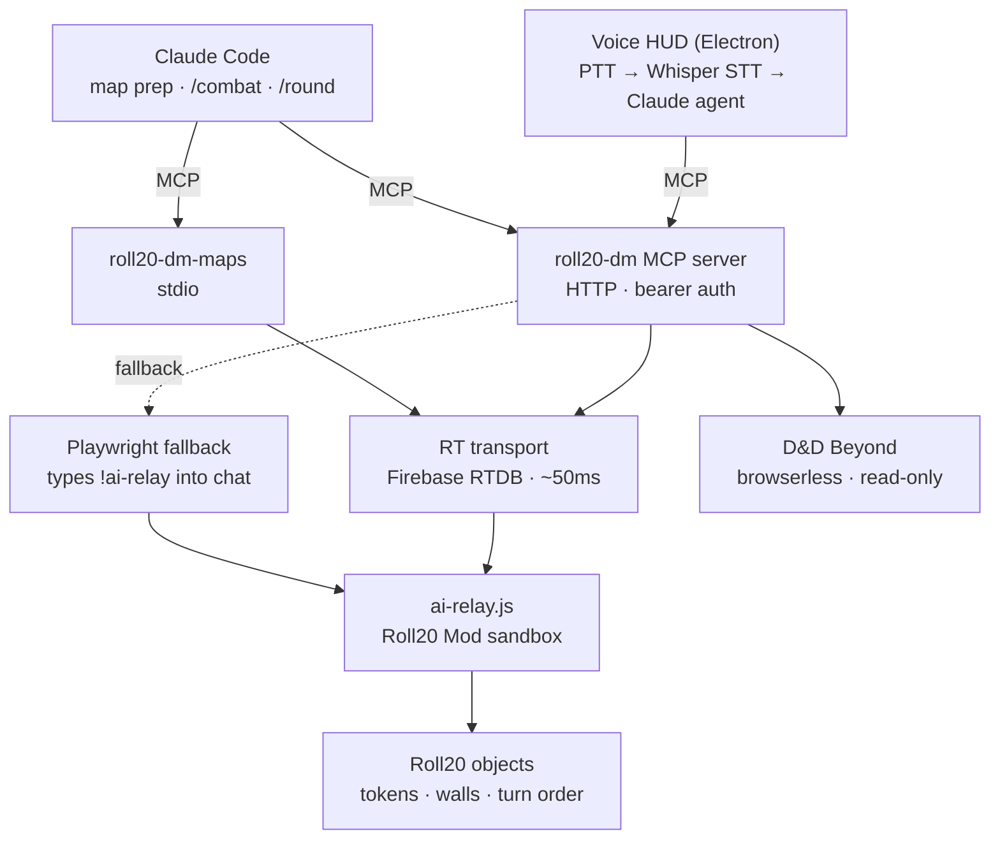
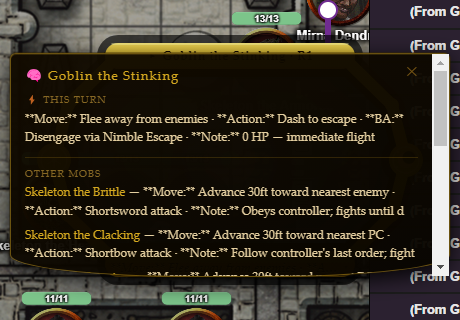
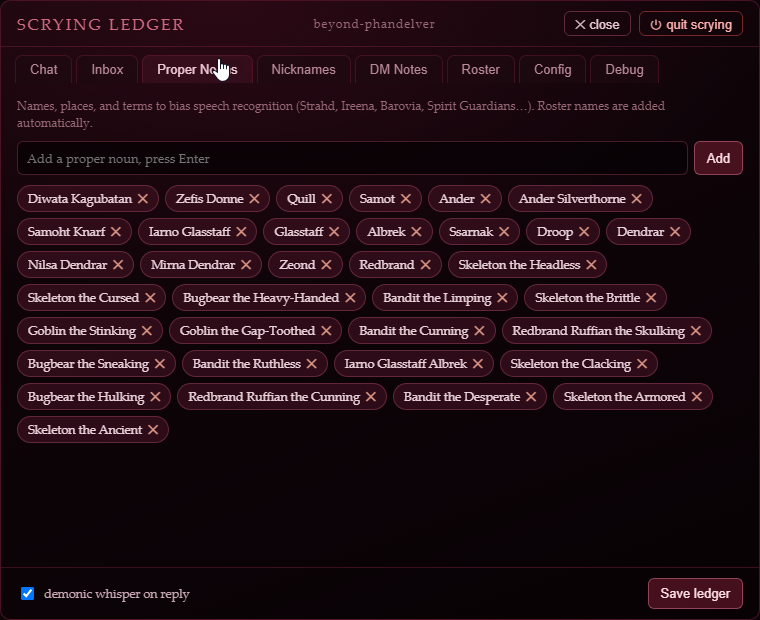
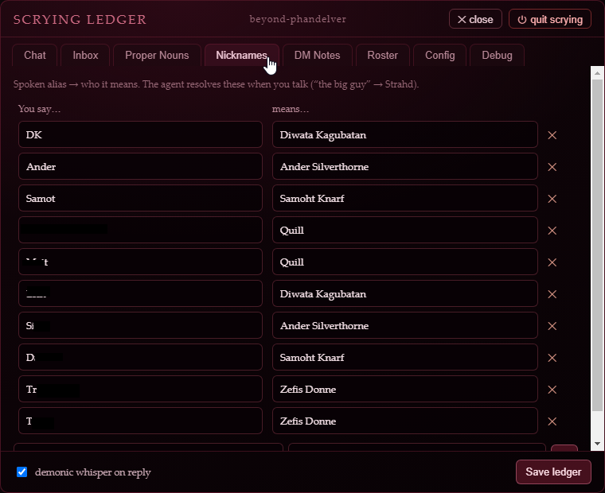

# roll20-dm-mcp

AI-assisted D&D 5e session management for Roll20 + D&D Beyond. Three components:

- **`roll20-dm` MCP server** — live combat assistant over HTTP: HP tracking, conditions, initiative, dice, narration, turn hooks, AoE targeting, zones, tactical AI advisor, DDB character/monster reads.
- **`roll20-dm-maps` MCP server** — map prep pipeline (stdio): upload battlemaps, auto-place dynamic lighting walls via Claude Vision, token creation.
- **Voice HUD** (`voice-hud/`) — transparent Electron overlay: push-to-talk → Whisper STT → Claude agent → live tabletop. The DM speaks; the gem acts.



> *The push-to-talk **scrying gem** overlaying a live Roll20 fight — the gold tray surfaces the current combatant's tactics; the turn order sits at left. More shots in the [Voice HUD](#voice-hud) section.*

## Architecture



<details><summary>Detailed text view</summary>

```
┌─────────────────────────────────────────────────────┐
│  Voice HUD (Electron)                               │
│  PTT → Whisper STT → Claude Haiku agent             │
│  transparent gem overlay, always on top             │
└────────────────────┬────────────────────────────────┘
                     │ HTTP MCP (bearer auth, port 39200)
┌────────────────────▼────────────────────────────────┐
│  roll20-dm MCP server (HTTP, src/index-http.ts)     │
│                                                     │
│  ┌── RT transport (set ROLL20_TRANSPORT=rt) ──┐     │
│  │  Firebase RTDB: direct reads (~50ms warm)  │     │
│  │  + relays !ai-relay commands (reads AND    │     │
│  │  writes) to the Mod, reads result back.    │     │
│  │  signInWithCustomToken harvested once,      │     │
│  │  cached to data/roll20-rt-token.json        │     │
│  └────────────────────────────────────────────┘     │
│                                                     │
│  ┌── Mod relay FALLBACK (Playwright) ─────────┐     │
│  │  used only if RT is unavailable:           │     │
│  │  !ai-relay {JSON} typed into Roll20 chat   │     │
│  │  ← result via MutationObserver             │     │
│  └────────────────────────────────────────────┘     │
│  (the Roll20 Mod sandbox executes every action,     │
│   createObj/.set, regardless of which transport)    │
│                                                     │
│  ┌── D&D Beyond (browserless) ────────────────┐     │
│  │  CobaltSession cookie → JWT (ttl 300s)     │     │
│  │  character-service / monster-service       │     │
│  │  plain fetch, no browser needed            │     │
│  └────────────────────────────────────────────┘     │
└─────────────────────────────────────────────────────┘

Claude Code (separate MCP client, same server)
  └── map prep, session setup, /combat, /round skills
```

</details>

### Transport layers

| Layer | Read latency | Write latency | When used |
|---|---|---|---|
| RT (Firebase RTDB) | ~50ms warm | ~50ms warm | When `ROLL20_TRANSPORT=rt` — reads AND writes: direct RTDB reads + `!ai-relay` command relay to the Mod |
| Mod relay (Playwright) | 3–4s | 3–4s | Used when RT is unset, and as the fallback for any action if RT is unavailable (auth/timeout/circuit-open) |
| DDB REST | ~200ms | — | Character sheets, monster stats, campaign roster (read-only) |

The browser window opens for the initial RT token harvest (and DDB cookie harvest) and as the relay fallback when RT is down. It sits minimized otherwise and pops to the foreground when a manual login is needed.

## Setup

```bash
cp .env.example .env
# Required: ANTHROPIC_API_KEY, ROLL20_EMAIL, ROLL20_PASSWORD
# Optional: DDB_COBALT (skip DDB browser harvest), ROLL20_MCP_TOKEN (auto-generated if absent),
#           ROLL20_TRANSPORT (set "rt" to enable the Firebase RTDB transport; unset = Playwright path),
#           DDB_TRANSPORT (defaults to "rt"; set "browser" for the legacy DDB path)

npm install
npx playwright install chromium
npm run build
```

### First run

```bash
npm run serve          # starts roll20-dm HTTP server on port 39200
```

On first run with no `ROLL20_MCP_TOKEN` in `.env`, the server auto-generates a token, writes it to `.env`, and updates `.mcp.json` with the bearer header. Restart Claude Code once to pick up the new header.

`.mcp.json` is gitignored — it contains the live bearer token and is regenerated automatically.

## MCP server registration

Servers are defined in `.mcp.json` (gitignored, auto-managed):

| Key | Transport | Entry point | Use when |
|---|---|---|---|
| `roll20-dm` | HTTP (port 39200) | `src/index-http.ts` (`npm run serve`) | Live session or Voice HUD |
| `roll20-dm-maps` | stdio | `dist/index-maps.js` | Map prep between sessions |

## Deploy the Roll20 Mod script

1. Open your Roll20 campaign → Settings → API Scripts
2. Create a new script, paste `mod-scripts/ai-relay.js`
3. Save — active immediately, no restart needed

The relay receives `!ai-relay {JSON}` commands and whispers results back as hidden divs read by a MutationObserver in the Playwright session.

## Voice HUD

The scrying gem — a transparent cushion-cut crystal overlay that floats above Roll20 in the corner of the screen.

| Tactic tray | Proper-noun vocab | Nickname aliases |
|---|---|---|
|  |  |  |

```bash
cd voice-hud
npm install
npm run start          # builds + launches Electron
```

**Controls:**
- Hold **Right Ctrl** → speak → release to send (configurable via `DMW_PTT_KEY`)
- **Right Shift** to confirm a proposed write action
- **Esc** to cancel
- Click the ✥ handle to drag the gem
- Click the ✦ icon to open the Scrying Ledger (full panel with Chat, Config, Debug tabs)

**Agent:** cloud Anthropic (Claude Haiku) only by default. Local Ollama is **mothballed and off** — it's hidden unless you set `DMW_ENABLE_LOCAL_LLM=1`, which surfaces the cloud/local brain buttons in the Chat tab (selection then persists across restarts). With the flag unset there is no visible toggle and the provider is forced to cloud.

**STT:** bundled **whisper.cpp resident server** (`whisper-server` + `ggml-base.en.bin`) — runs on CPU out of the box, no Python. GPU is a drop-in cuBLAS/Vulkan binary swap via `DMW_WHISPER_BIN`. The old Python faster-whisper sidecar is mothballed behind `DMW_STT_ENGINE=faster-whisper`. A **global base vocabulary** of common D&D terms (initiative, saving throw, the abilities/skills/conditions/damage types, dice) plus per-campaign character names, nicknames, and vocab are injected as `initial_prompt` for every transcription, updated after each agent turn. The base set lives in `voice-hud/src/baseVocab.ts` (separate from per-campaign vocab) — extend it without touching code via a JSON array at `<DMW_DATA_DIR>/base-vocab.json`.

**STT correction** (`voice-hud/src/correction.ts`): a deterministic post-STT pass that fixes Whisper's residue against the same glossary, in microseconds. Three ordered, toggleable passes — (1) **notation** (`"two dee six"` → `2d6`, `"nat twenty"` → `nat 20`), (2) **literal map** (exact swaps like `"dee see"` → `DC`), (3) **fuzzy + phonetic**: Double Metaphone is the primary gate, fuzzy ratio secondary, with a common-word guard so real English is left alone (`cave`↛`save`). Despaced multi-word spans match single-word names, so a split name like `"hair gone"` → `Haregon`. Built for precision — a missed correction is cheap; a wrong one corrupts the parse, so stubborn names go in the literal map.

**Config:** all runtime knobs (PTT key, STT model, MCP URL, provider, etc.) are exposed in the Scrying Ledger Config tab and persisted to `voice-hud/.env`.

**Debug:** the Scrying Ledger Debug tab streams the main process `console.error` log live, with 500-entry history.

## Campaign context

`data/campaign-context.json` is the shared source of truth for per-campaign vocab, nickname aliases, and DM notes. Both the MCP server tools (`add_vocab`, `add_nickname`, `set_campaign_notes`) and the Voice HUD wizard panel read and write this file. The agent can extend it at any time via tool calls.

## Claude Code skills

`.claude/commands/` contains slash commands for live sessions:

- `/combat` — session startup: switch campaign, list tokens, enable turn hook, roll NPC initiative, arm player inbox loop, plan all tactics
- `/round` — parse DM narration → propose action list (HP changes, conditions, narration) → execute on confirmation

## Tactical Advisor

`plan_tactics` / `plan_all_tactics` generates per-monster turn plans scaled to creature Intelligence and Wisdom. Called automatically at combat start and at the top of each round (both from the `/combat` skill and the Voice HUD agent).

| Tier | Int/Wis avg | Model (thinking budget) | Cascade | Behavior |
|---|---|---|---|---|
| 0 Feral | ≤5 | Haiku | none | Pure instinct |
| 1 Dim | ≤8 | Haiku | none | Basic predatory logic |
| 2 Average | ≤11 | Sonnet | none | Reads the battlefield |
| 3 Sharp | ≤15 | Sonnet (3k) | none | Coordinates with allies |
| 4 Brilliant | ≤20 | Sonnet (8k) | medium: Haiku → Sonnet | Short + medium-term planning |
| 5 Mastermind | 21+ | Opus (16k) | full: Haiku → Sonnet → Opus | Full 3-stage strategic cascade |

(Tiers 0–3 run a single model; tiers 4–5 run a multi-model cascade — the "Model" column is the final/long-term stage. See `TIER_CONFIGS` in `src/tools/tactics.ts`.)

Plans are whispered GM-only and surfaced again automatically when the initiative tracker reaches each mob's turn.

## Key design decisions

**RT transport carries reads and writes.** The Firebase RTDB token is harvested once via browser (intercepting `signInWithCustomToken`), cached to `data/roll20-rt-token.json`, and reused. Reads come straight off RTDB; writes (and Mod-served reads) are relayed as `!ai-relay` commands over RTDB to the Mod, which executes them and writes the result back. The Playwright chat path is a fallback used only when RT is unavailable (a shared per-command nonce + the Mod's `PROCESSED_NONCES` LRU make the rt→browser fallback idempotent even for mutations).

**D&D Beyond is fully browserless.** `CobaltSession` cookie is harvested once and cached to `data/ddb-cobalt.json`. Every DDB read thereafter is a plain HTTPS fetch via `character-service` or `monster-service` — no Chromium involved.

**D&D Beyond is read-only.** HP and conditions are tracked on Roll20 tokens. DDB is polled for character state (HP, conditions, stats) but never written to.

**PC initiative is read-only.** `roll_initiative` always uses `npcOnly=true`. Players set their own initiative; the Mod never touches PC entries.

**Player initiatives are preserved, not wiped.** A raw wholesale `setTurnOrder` would replace the entire order (erasing players), so the initiative paths avoid it: `roll_initiative` writes via an atomic `mergeTurnOrder` (read-merge-write in one tick), and `clearFirst=true` strips **only** NPC entries (`clearNpcFirst`) — player-controlled entries and round markers are always kept. `update_turn_order` upserts a single entry the same way. The only wholesale wipe is `clear_turn_order` (explicit, between encounters); `setTurnOrder` is also reachable via `batch_exec` if you pass it deliberately. So a player's rolled/assigned initiative survives rolling and adjusting — it's erased only when you clear it.

**AoE emanations use token auras; fixed areas use zones.** Spirit Guardians, Aura of Protection, etc. → `set_token_props aura1_radius`. Fireball, Web, Cloudkill → `create_zone` on the map layer.

**Duplicate token epithets.** Tokens sharing a name get epithets at initiative roll time (`Wolf the Scarred`, `Wolf the Gaunt`) — assigned from creature-type word banks, stored in the token name.

**Tactical data cached in gmnotes.** Monster ability scores and action text are written to `gmnotes` on first plan under `TACDATA:`. Subsequent plans skip the DDB lookup — survives MCP server restarts.

**Shared campaign context.** `data/campaign-context.json` is written by the MCP server tools, the Voice HUD wizard, and the agent's `add_vocab`/`add_nickname` calls — one file, no sync needed.
