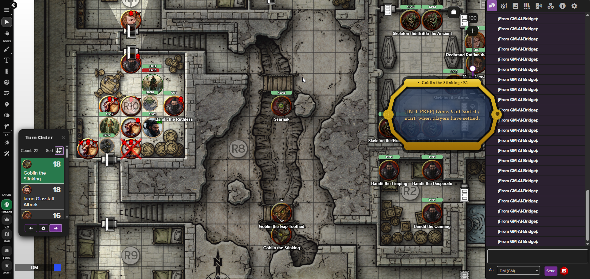
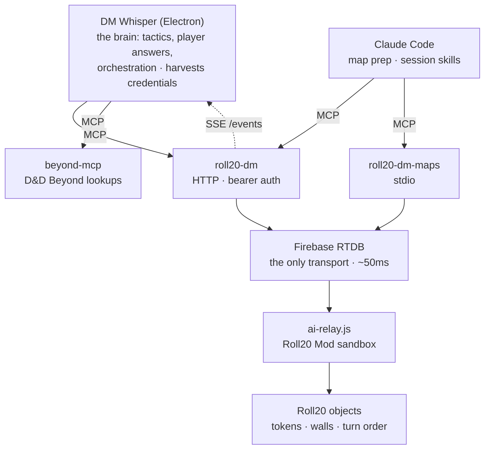

# roll20-dm-mcp

MCP servers that drive a **Roll20** table: hit points, conditions, initiative, dice, narration,
areas of effect, dynamic-lighting walls, tokens and maps — as primitives an AI assistant can call
during a live D&D 5e session.

Two servers, one job each:

- **`roll20-dm`** — live combat, over HTTP. HP and conditions, initiative and turn order, dice,
  narration, AoE resolution, zones, mob-plan storage, the DM inbox, and an SSE event stream.
- **`roll20-dm-maps`** — map prep, over stdio. Battlemap upload and placement, Claude-Vision wall
  detection, dynamic-lighting walls and doors, page creation, token creation.

**Roll20 only.** No D&D Beyond, no language model in the combat server, and **no browser anywhere** —
`playwright` is not a dependency and neither server can open one. If a thing genuinely needs a
browser, it isn't a tool here.



> *[DM Whisper](https://github.com/eschatus/dm-whisper) — a separate project — pushing this server
> during a live fight. The DM speaks; the gem decides; this server makes it true on the board.*

## Where this sits

This repo is one backend among several. It does **not** contain the intelligence.


```mermaid
flowchart TD
    GEM["DM Whisper (Electron)<br/>the brain: tactics, player answers,<br/>orchestration · harvests credentials"]
    CC["Claude Code<br/>map prep · session skills"]
    SRV["roll20-dm<br/>HTTP · bearer auth"]
    MAPS["roll20-dm-maps<br/>stdio"]
    BEY["beyond-mcp<br/>D&D Beyond lookups"]
    RT["Firebase RTDB<br/>the only transport · ~50ms"]
    MOD["ai-relay.js<br/>Roll20 Mod sandbox"]
    R20["Roll20 objects<br/>tokens · walls · turn order"]

    GEM -->|MCP| SRV
    GEM -->|MCP| BEY
    CC -->|MCP| SRV
    CC -->|MCP| MAPS
    SRV --> RT
    MAPS --> RT
    RT --> MOD
    MOD --> R20
    SRV -.->|SSE /events| GEM
```

| repo | owns |
|---|---|
| **roll20-dm-mcp** (here) | the Roll20 bridge — primitives and the event stream |
| [dm-whisper](https://github.com/eschatus/dm-whisper) | the brain, the voice UI, and credential harvesting |
| [beyond-mcp](https://github.com/eschatus/beyond-mcp) | D&D Beyond reads — characters, monsters, party snapshots |

The gem talks to each backend through an anti-corruption layer, so this server stays deliberately
**Roll20-native** rather than pretending to be a generic VTT interface.

## How a tool call reaches the table

```
assistant → MCP tool (TypeScript) → relayCommand({action, …})
          → Firebase RTDB → ai-relay.js (Roll20 Mod sandbox) → Roll20 objects
```

The Mod script executes every action; the transport just carries it. Some reads are served straight
off RTDB without troubling the Mod, and page creation writes the `pages` node directly.

**RT is the only transport.** There is no browser fallback — if the realtime connection fails, you
get a loud, actionable error rather than a silent detour.

## Credentials are furnished, never minted

This server **reads** its credentials and never harvests them. That is deliberate: harvesting means
driving a browser against your live Roll20 account, which is a human-attended act.

| file (in the data dir) | what it is | lifetime |
|---|---|---|
| `roll20-rt-token.json` | the realtime credential — **campaign-scoped**, carries that campaign's RTDB shard | ~50 min |
| `roll20-upload-cache.json` | endpoint + cookies for art upload (uploads themselves are a plain HTTP POST) | 8 h |

When one is missing, stale, or belongs to a different campaign, you get a typed error
(`Roll20TokenUnavailableError`, `Roll20UploadCredentialError`) that names what to refresh.

**DM Whisper is the supported harvester** — its *Connect Roll20* button opens a window, you log in,
and it writes both files. Point `ROLL20_DATA_DIR` at the same directory the gem uses, or the two
will silently diverge. Running without the gem means building the token file by hand; see
[docs/mcp-setup-for-dms.md](docs/mcp-setup-for-dms.md).

## Quick start

```bash
npm install          # Node 20+. No browser download — there is no Chromium step.
npm run serve        # roll20-dm on http://127.0.0.1:39200/mcp (+ /events)
npm run build        # required for the stdio maps server
```

First run generates `ROLL20_MCP_TOKEN` into `.env`. Register a campaign, furnish a token, and deploy
the Mod relay — the full walkthrough is in **[docs/mcp-setup-for-dms.md](docs/mcp-setup-for-dms.md)**
(DM-facing) or **[docs/setup-guide.md](docs/setup-guide.md)** (developer-facing).

`ANTHROPIC_API_KEY` is needed only by the maps suite's `analyze_battlemap`. The combat server makes
no model calls at all.

## Deploying the Mod relay

`mod-scripts/ai-relay.js` runs inside Roll20's API sandbox, and a change to it takes effect only
once deployed. **You deploy it by hand** — paste it into the campaign's *Settings → API Scripts* and
save. There is no deploy tool and no `release:mod` script; both drove a browser.

Two things worth knowing:

- **Verify the load, not the save.** The Mod console must print
  `[GM_AI_Bridge] Relay script loaded (v2.6.1)`. A successful paste is not a running script.
- **Deploys are per-campaign.** Each campaign carries its own copy, so one table can be running an
  older relay than another. A mismatch is reported through `transport_status`.

## What the servers expose

**`roll20-dm`** — tokens and HP (`update_token_hp`, `update_hp_many`, `kill_token`, `set_pc_dying`),
conditions and markers (`set_token_marker`, `break_concentration`), initiative
(`roll_initiative` with explicit `entries`, `update_turn_order`, `inject_round_marker`,
`advance_turn`), dice (`roll_dice`, `post_roll_as_character`), AoE (`resolve_aoe`) and zones,
character-sheet reads and writes, mob plans (`set_mob_plan`, `get_mob_plans`, `clear_mob_plans`),
the DM inbox, narration and whispers, `batch_exec`, and campaign management.

**`roll20-dm-maps`** — `analyze_battlemap`, `setup_roll20_page`, `upload_and_place_map_image`,
`auto_place_dl_walls`, `decorate_openings`, `place_polyline_walls`, token creation, layer and FX
tools, and `batch_import_maps`.

HP routing is three-way and deliberate: **PCs** track HP in relay state (never their token bar —
Beyond20 owns that), **NPCs** use `bar1`, and **sidekicks** are player-controlled but route as NPCs
via a registry override. Tools pick the path; callers don't.

### The event stream

`GET /events` (bearer auth) is a Server-Sent Events stream: `combat-update`, `chat-message` (every
live table message and `!`-command, forwarded raw), `mob-plan` (`plan: null` means cleared),
`inbox-item`, `map-ping`, `sandbox-status`. This is how an external brain follows the table without
polling.

## Development

```bash
npm test             # vitest — includes a Roll20 Mod emulator that runs the real ai-relay.js
npm run lint
```

The emulator loads `mod-scripts/ai-relay.js` into a Node `vm` with a fake Roll20 API, so relay
behaviour is testable without a browser or a live game.

Start with **[CLAUDE.md](CLAUDE.md)** — it's the orientation doc, and it documents the gotchas that
have actually bitten this project (the `setSafe` write chokepoint, hand-synced tables the Mod
sandbox can't import, initiative-safety rules, and the page-creation unit trap).

Deep dives live in [docs/](docs/): architecture decisions, the realtime protocol, API coverage,
security, and choreography.

## Related

- [dm-whisper](https://github.com/eschatus/dm-whisper) — the voice gem; pins this repo by tag
- [beyond-mcp](https://github.com/eschatus/beyond-mcp) — D&D Beyond lookups
- `roll20-recon` — browser-driven protocol archaeology, kept out of this repo on purpose

## License

MIT — see [LICENSE](LICENSE) and [NOTICE](NOTICE).
